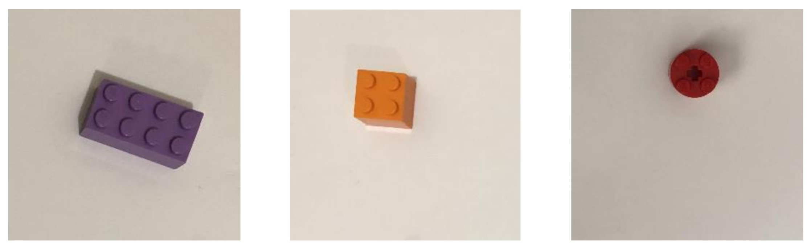

This project uses a machine-learning approach to sort circular, rectangular, and square-shaped LEGO blocks based on raw image data. In stage 1, a simple logistic regression model effectively classifies the provided dataset containing idealized raw image data of centered and oriented LEGO blocks. However, this model performs poorly with raw image datasets containing angled and disoriented LEGO blocks. To address this issue, feature engineering is integrated. In stage 2, the 3-class K-nearest neighbor classifier is trained using engineered features. A sample of the stage 2 dataset is presented below.

    

